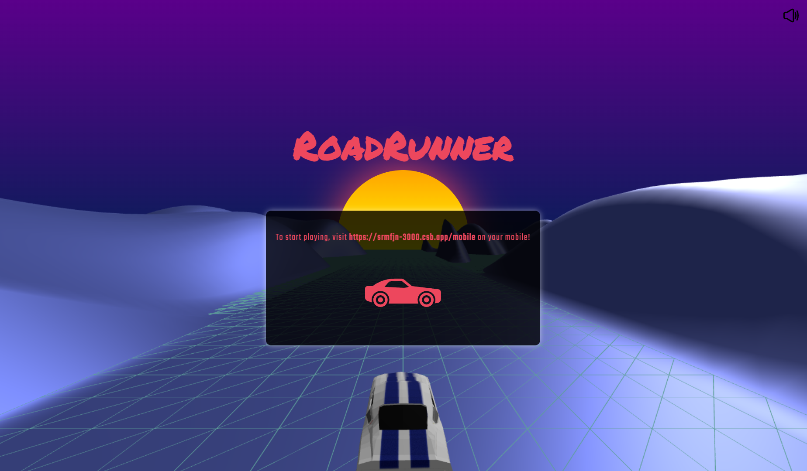
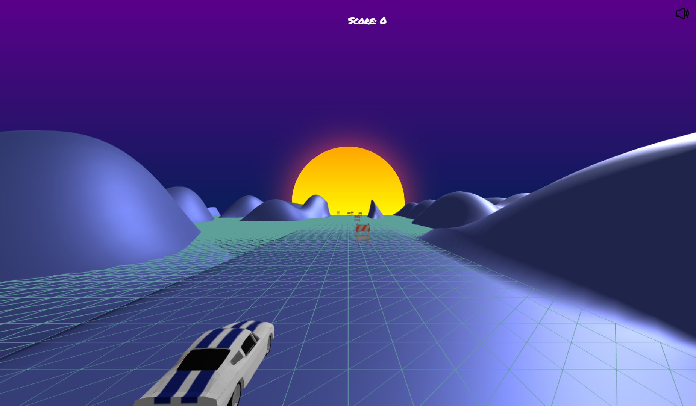
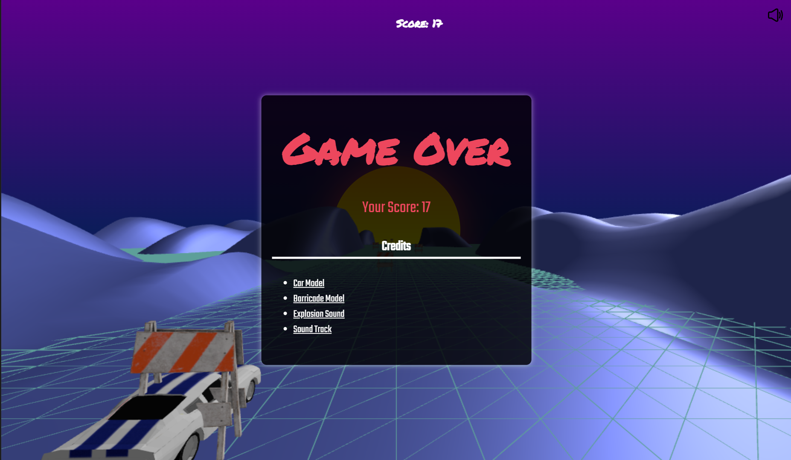

# RoadRunner

RoadRunner is a thrilling and immersive racing experience built using Three.js and Socket.io. In this game, you'll navigate through an endless track, controlling your car's movements using the orientation of your mobile device.

- Live: https://srmfjn-3000.csb.app/
- CodeSandbox: https://codesandbox.io/p/github/amit-ksh/roadrunner/
- Github: https://github.com/amit-ksh/roadrunner

## Controls

- Mobile Device Orientation: Tilt your mobile device left or right to control the car's movements.

## Technologies

- Three.js: A powerful 3D graphics library for creating visually stunning web-based applications.
- Socket.io: Enables real-time, bidirectional, and event-based communication for multiplayer functionality.

## Images

